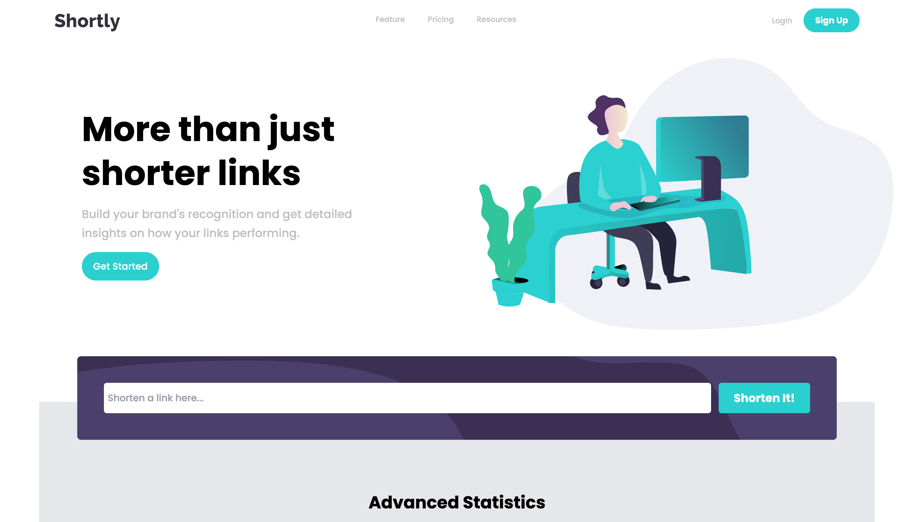

# Shortly URL Shortener App Landing Page

This is my URL Shortener App Landing Page Project.

## I used

- React.js
- Tailwind.css
    - Responsive Design

## Available Scripts

In the project directory, you can run:

### `npm start`

Runs the app in the development mode.\
Open [http://localhost:3000](http://localhost:3000) to view it in your browser.

The page will reload when you make changes.\
You may also see any lint errors in the console.

## Colors

### Primary

- Cyan: hsl(180, 66%, 49%)
- Dark Violet: hsl(257, 27%, 26%)

### Secondary

- Red: hsl(0, 87%, 67%)

### Neutral

- Gray: hsl(0, 0%, 75%)
- Grayish Violet: hsl(257, 7%, 63%)
- Very Dark Blue: hsl(255, 11%, 22%)
- Very Dark Violet: hsl(260, 8%, 14%)

## Typography

### Body Copy

- Font size: 18px

### Fonts

- Family: [Poppins](https://fonts.google.com/specimen/Poppins)
- Weights: 500, 700